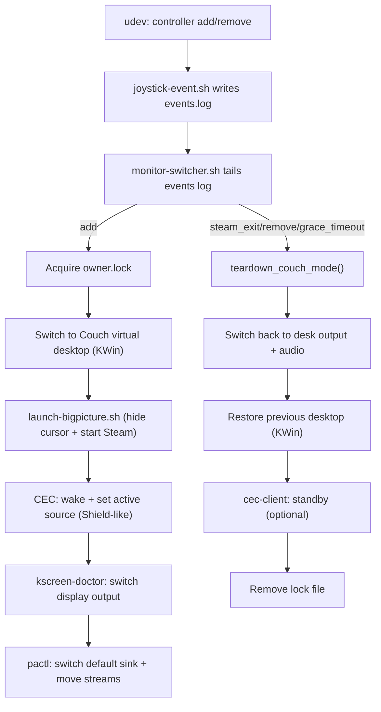

# joystick-notify

Controller-driven “couch mode” automation for KDE Plasma (Wayland): switch to a dedicated desktop, hide the cursor, start Steam Big Picture, wake the TV and switch it to the PC’s HDMI input via CEC, then move video + audio output to the TV. When couch mode ends, restore desk output first, then restore the previous desktop, and optionally put the TV into standby.

This folder contains everything needed to install the workflow:
- Scripts installed into `/usr/local/bin`
- udev rules in `/etc/udev/rules.d`
- systemd **user** units in `~/.config/systemd/user`
- Optional tray icon service

## High-level flow



## Components (by file)

### `scripts/joystick-event.sh`
Runs as root via udev and appends a single line per event to:
- **`/tmp/joystick-notify/logs/events.log`** (mode `666`)

It also ensures the flock lock is usable from both root (udev) and your user service:
- **`/tmp/joystick-notify/locks/events.lock`** (mode `666`)

Log format:
```
<ISO-8601> <add|remove|...> <device-id>
```

Device id is an opaque identifier; typically:
- Bluetooth: `HID_UNIQ` (MAC)
- Some USB cases: `eventNN`

### `scripts/monitor-switcher.sh`
Long-running user service that tails `/tmp/joystick-notify/logs/events.log` and drives the workflow.

Key concepts:
- **Owner lock**: `/tmp/joystick-notify/locks/owner.lock` contains the “owner” device id (first controller to connect).
- **Persistence**: Couch Mode stays active even if the controller disconnects, as long as a game (detected via `gamescope`) is running.
- **Grace period**: 
  - If a controller disconnects while Steam is running but no game is active, a 30-second grace period starts.
  - If the controller re-connects during this window, the session resumes without screen flickering or HDMI-CEC re-triggers.
  - If the grace period expires without a controller, the mode tears down.
- **Immediate Teardown**: If Steam is closed, Couch Mode ends immediately regardless of controller state.
- **Synthetic events**: internal timers/watchers emit events back into the same log stream (e.g. `grace_timeout`, `steam_exit`) using a reliable append.
- **KWin virtual desktop isolation**:
  - Saves current desktop to `/tmp/joystick-notify/locks/prev-desktop.$UID`
  - Switches to a desktop named `Couch` (or `COUCH_DESKTOP_NUM`)
  - Restores the previous desktop on teardown (after switching outputs back to desk)
- **CEC** (libcec / v4l-utils): Shield-like behavior when possible: discovers the CEC adapter’s physical address and sends power-on + active source so the TV (and receiver, if present) switch to the PC’s input automatically; no port configuration is needed for typical setups. Uses `cec-ctl` when available; falls back to `cec-client` with `CEC_HDMI_PORT`. Optionally set `CEC_WAKE_DELAY` (e.g. 1–2 s) for receiver chains. Sends TV standby on teardown when enabled.

Logs:
- **`/tmp/joystick-notify/logs/watcher.log`**: monitor-switcher internal log
- **`/tmp/joystick-notify/logs/events.log`**: raw event stream (udev + synthetic)

### `scripts/launch-bigpicture.sh`
Starts Steam Big Picture in a way that works well on Plasma Wayland and manages cursor hiding:
- Enables KWin “Hide Cursor” effect (best-effort) at startup
- Restores the user’s previous KWin cursor settings on exit
- Starts Steam:
  - If already running: `steam://open/bigpicture`
  - Otherwise: `steam -gamepadui`
- Stays alive while `/tmp/joystick-notify/locks/owner.lock` exists so cursor hiding remains active

### `scripts/force-desk-primary.sh`
Enforces the desk monitor as the primary display and **disables the TV** by default.
- Triggered by `udev` on any display change.
- Checks for `/tmp/joystick-notify/locks/owner.lock`; if it exists (Couch Mode), it exits without doing anything.
- If no lock exists, it ensures `HDMI-A-2` is primary and `HDMI-A-1` is disabled.
- This prevents the TV from stealing focus or being used as a secondary monitor when you just want to use your desk.

### `scripts/game-wrapper.sh`
A wrapper script that conditionally uses `gamescope` when the TV is active.
- Detects if the TV output (`HDMI-A-1` by default) is enabled via `kscreen-doctor`.
- If active, launches the command with `gamescope` using optimized performance flags and explicit resolution settings.
- Otherwise, executes the command normally.

To use in Steam:
1. Right-click a game → **Properties** → **General**.
2. Set **Launch Options** to exactly: `game-wrapper.sh %command%`

#### Configuration (Environment Variables)
You can customize the resolution by prefixing the launch option:
- `OUT_W` / `OUT_H`: Output resolution (default: `3840x2160`).
- `GAME_W` / `GAME_H`: Internal game resolution (default: matches `OUT_W/H`).
- `WRAPPER_DEBUG`: Set to `true` to enable logging to `/tmp/game-wrapper.log`.

Example for 1080p upscaling to 4K with debug logging:
`WRAPPER_DEBUG=true GAME_W=1920 GAME_H=1080 game-wrapper.sh %command%`

#### Global Wrapper (Proton Games)
The `launch-bigpicture.sh` script automatically sets `STEAM_COMPAT_COMMAND_PREFIX="game-wrapper.sh"`. This means:
- **All Proton games** will automatically use `gamescope` when playing on the TV.
- No manual per-game setup is required for most titles.
- Native Linux games still require manual setup (`game-wrapper.sh %command%`) or forcing Proton.

**How to disable for a specific game:**
If a game is incompatible with the global wrapper, you can disable it by setting a different prefix in the game's **Launch Options**:
`STEAM_COMPAT_COMMAND_PREFIX="" %command%`

#### Troubleshooting Performance
If you experience slowdowns over long sessions:
- Ensure your user is in the `gamemode` or `realtime` group to allow `--rt` (real-time priority) to work effectively.
- Check if your TV supports and has "Game Mode" or "Adaptive Sync/VRR" enabled.

### `udev/99-joystick-notify.rules`
Triggers `joystick-event.sh` on controller connect/disconnect.

Notable behaviors:
- Prefers Bluetooth HID events using `HID_UNIQ` (stable across `/dev/input/eventN` churn).
- Includes optional rules for:
  - Ignoring legacy `js*` nodes for Xbox Wireless Controller (keeps evdev usable).
  - Loading `xpad` and binding IDs for an 8BitDo receiver.
  - Triggering USB joystick events for a specific 8BitDo dongle via `event*`.

### `udev/71-8bitdo-controllers.rules`
Misc device-specific tweaks (permissions / power settings) for certain controllers.

### `systemd/joystick-notify.service`
Main **systemd user service** that runs `monitor-switcher.sh`.

Highlights:
- Waits for PipeWire/Pulse to be ready (via `pactl info`).
- Sets user-session env vars (`XDG_RUNTIME_DIR`, `DBUS_SESSION_BUS_ADDRESS`).
- On service stop, runs `ExecStopPost` to revert audio/display and remove the lock file.

### `systemd/joystick-notify-steam-shutdown.path` and `.service`
Watches `/tmp/joystick-notify/locks/owner.lock` changes. When couch mode ends (lock disappears) it runs a oneshot that attempts to shut down Steam.

Important detail:
- The service is guarded so it only calls `steam -shutdown` if Steam is already running (prevents “spawn Steam just to shut it down”).

### `systemd/joystick-notify-tray.service`, `system-tray/joystick-tray.py`, `system-tray/joystick-notify-tray.desktop`
Optional tray icon (PyQt6) to start/stop/restart the user service and open recent logs.

## Installation

Run as your normal user (installer uses `sudo` only for root-owned locations):

```bash
./install.sh
```

To install without enabling/starting services:

```bash
./install.sh --no-enable
```

The installer copies:
- Scripts → `/usr/local/bin/`
- udev rules → `/etc/udev/rules.d/`
- systemd user units → `~/.config/systemd/user/`
- desktop entry → `~/.local/share/applications/`

## Dependencies

Required (core workflow):
- `bash`
- `systemd` user services
- KDE Plasma (Wayland) with:
  - `qdbus6`
  - `kreadconfig6` / `kwriteconfig6`
  - `kscreen-doctor`
- PipeWire/Pulse compatibility: `pactl`
- Notifications: `notify-send` (optional; best-effort)
- Steam: `steam`

GPU / Display Driver (critical for TV output):
- **The couch HDMI port must be visible to the OS as "connected" for `kscreen-doctor` to switch output to it.** If the TV/receiver is off at boot, the GPU may not detect the port and mark it disconnected — in which case no software can switch to it.
- **AMD (amdgpu) on Navi/RDNA:** `amdgpu.dc=1` must be set as a kernel parameter. Despite being documented as default on some GPUs, it is not always applied automatically and must be explicit. Without it, display composition (DCN) is disabled and multi-connector hotplug may not function correctly.
- **EDID at boot:** If the TV/receiver is off when the machine boots, the GPU cannot read EDID from that port and marks it disconnected. The fix is a boot-time EDID override via the DRM debugfs interface. You need:
  1. An EDID binary for your TV saved to `/lib/firmware/edid/tv.bin` (capture with `get-edid | tee /lib/firmware/edid/tv.bin` while the TV is on, or dump it from `/sys/class/drm/card1-HDMI-A-1/edid`).
  2. A system service that injects it at boot:
     ```ini
     # /etc/systemd/system/hdmi-edid-override.service
     [Unit]
     Description=Inject EDID override for HDMI-A-1 (TV/receiver presents no DDC at boot)
     After=sys-kernel-debug.mount systemd-udev-settle.service

     [Service]
     Type=oneshot
     ExecStart=/bin/sh -c 'cp /lib/firmware/edid/tv.bin /sys/kernel/debug/dri/1/HDMI-A-1/edid_override && echo on > /sys/kernel/debug/dri/1/HDMI-A-1/force && echo 1 > /sys/kernel/debug/dri/1/HDMI-A-1/trigger_hotplug'
     RemainAfterExit=yes

     [Install]
     WantedBy=multi-user.target
     ```
     Enable with `sudo systemctl enable --now hdmi-edid-override.service`. Adjust the DRI path (`dri/1`) and connector name (`HDMI-A-1`) to match your GPU.
  3. Kernel parameters: `amdgpu.dc=1 drm.edid_firmware=card1-HDMI-A-1:edid/tv.bin video=card1-HDMI-A-1:e` in GRUB as a belt-and-suspenders fallback (the service above is the reliable path).

CEC (recommended):
- `cec-ctl` (v4l-utils) and/or `cec-client` (libcec). Prefer `cec-ctl` for automatic input switching (no port config).
- Ensure your user can access the CEC adapter (e.g. `/dev/cec0` for cec-ctl, or `/dev/ttyACM0` for some USB CEC dongles with cec-client; `uucp` group may be required).

Tray icon (optional):
- `python3`
- `PyQt6`

## Configuration

Configuration is via environment variables (set them in your systemd user unit via a drop-in).

Main behavior:
- `DEBUG_MODE=false`: if true, enables detailed debug logging across components
- `DISCONNECT_GRACE=15`: seconds to wait before tearing down after disconnect (when Steam is running)
- `STEAM_POLL=2`: seconds between Steam exit checks

Virtual desktop:
- `COUCH_DESKTOP_NAME=Couch`
- `COUCH_DESKTOP_NUM=` (optional override; if set, name lookup is skipped)

CEC:
- `CEC_ENABLED=true`
- `CEC_HDMI_PORT=3` (fallback for cec-client when cec-ctl is not used)
- `CEC_COUCH_PORT` (when cec-ctl discovery fails, if 1–4 used as phys-addr N.0.0.0 for set-stream-path/active-source)
- `CEC_ACTIVE_SOURCE_PHYS_ADDR` (optional, e.g. `2.0.0.0` for receiver HDMI 2; overrides discovered address so the AVR switches to the correct input)
- `CEC_WAKE_DELAY=0` (seconds to wait after wake before set-stream-path/active-source; set to 1–2 for receiver chains if the TV or AVR does not switch reliably)
- `CEC_POWER_OFF_ON_TEARDOWN=true`

Audio:
- `HEADSET_SINK=...` (in script; can be edited or you can patch to env)
- TV sink auto-detection uses:
  - `TV_ALSA_CARD` (default `2`)
  - `TV_ALSA_DEVICE` (default `9`)
  - optional `TV_SINK` override

Example drop-in:

```ini
[Service]
Environment=DISCONNECT_GRACE=15
Environment=COUCH_DESKTOP_NAME=Couch
Environment=CEC_HDMI_PORT=3
Environment=CEC_POWER_OFF_ON_TEARDOWN=true
```

Apply:
```bash
systemctl --user daemon-reload
systemctl --user restart joystick-notify.service
```

## How to test pieces manually

### CEC: switch input to HDMI3 (often also powers on the TV)
```bash
printf 'as\nis\nas\nis\nas\nis\nq\n' | cec-client -s -d 1 -p 3
```

### CEC: standby (power off)
```bash
printf 'standby 0\nq\n' | cec-client -s -d 1 -p 3
```

### Observe the automation logs
```bash
tail -f /tmp/joystick-notify/logs/watcher.log
tail -f /tmp/joystick-notify/logs/events.log
```

## Troubleshooting

- **Stopped working after reboot (was working before)**
  - After a PC reboot, the receiver may not fully initialize in time for the GPU's initial EDID probe. The GPU then marks the port disconnected.
  - **Recovery:** Power on your receiver, set it to the PC input (e.g. HDMI 2), wait 10–15 seconds, then:
    ```bash
    sudo udevadm trigger --action=change /sys/class/drm/card1-HDMI-A-1
    /usr/local/bin/check-gpu-connectors.sh
    ```
    If `HDMI-A-1` now shows `connected`, your receiver was slow to initialize. Try connecting the controller again.
  - **Workaround:** If this happens frequently, increase the delay after CEC wakes the receiver. Set `CEC_WAKE_DELAY=5` (or higher) in your systemd drop-in to give the receiver more time to present EDID before the GPU probes. Restart the service and try again.
  - **Permanent fix:** Some receivers require an **HDMI EDID emulator** (hardware device between GPU and receiver) to always present a display during GPU probes. This is a receiver limitation, not a software issue.

- **Does the GPU see both HDMI cables?**
  - The GPU reports each connector as **connected** or **disconnected** in the kernel. If the port to your receiver shows disconnected, the issue is detection (cable, receiver, or GPU), not the couch/desk scripts.
  - **Quick check:** run the diagnostic script (after install: `/usr/local/bin/check-gpu-connectors.sh`) or run manually:
    ```bash
    for c in /sys/class/drm/card*-HDMI-*; do [ -d "$c" ] && [ -f "$c/status" ] && echo "${c##*/}: $(cat "$c/status")"; done
    ```
  - If the receiver’s port stays **disconnected**: reconnect the HDMI cable between GPU and receiver, power on the receiver and set it to the PC input, then **reboot the PC** so the GPU re-probes. Run the check again after reboot to see if that port becomes **connected**.

- **TV works during boot (shows boot messages) but is missing after boot (connector shows disconnected)**
  - **Check dmesg:** `dmesg | grep -iE 'EDID|HDMI-A-1|amdgpu.*ERROR'`. If you see **`EDID err: 2, on connector: HDMI-A-1`** and **`No EDID read`**, the GPU *is* probing that port but the **EDID read is failing** (err 2 = DDC/I2C: no response from the receiver). The driver then marks the connector disconnected. So the cause is **receiver not responding on the EDID (DDC) line**, not “kernel only using one connector”.
  - **No reboot required.** With receiver **on** and set to PC input, wait 10–15 s then run `sudo udevadm trigger --action=change /sys/class/drm/card1-HDMI-A-1` (adjust path) and run `check-gpu-connectors.sh` again. If it still shows disconnected, the receiver does not present EDID to the PC when that input is selected (receiver limitation). **Hardware workaround:** an **HDMI EDID emulator** between PC and receiver can always advertise a display so the PC sees the connector as connected.
  - **GRUB `video=`:** If dmesg does *not* show EDID errors, try removing `video=HDMI-A-2:...` from GRUB and rebooting once to test.
  - **amdgpu:** Some kernels ignore modprobe `enable_dc`; use kernel cmdline only if needed.

### Bluetooth Controller Stability

If your Bluetooth controller (e.g., 8BitDo Ultimate 2) randomly disconnects:

1. **USB 3.0 Interference**: USB 3.0 ports emit RF noise in the 2.4GHz band (same as Bluetooth). Move your Bluetooth dongle to a **USB 2.0 port** or use a USB extension cable to distance it from USB 3.0 devices.

2. **Power Management**: The udev rules include generic Bluetooth adapter power management rules to prevent autosuspend. After installation, reboot to ensure they take effect.

3. **Debug Logging**: Enable `DEBUG_BLUETOOTH=true` in your systemd drop-in to log all controller events to `/tmp/bluetooth-events.log`:
   ```ini
   [Service]
   Environment=DEBUG_BLUETOOTH=true
   ```

### Game Not Re-detecting Controller After Reconnect

Some games (e.g., Vampire Survivors) don't re-detect the controller after a Bluetooth reconnect because they hold onto the old device handle.

**Workarounds (in order of preference):**

1. **Steam Input Re-initialization**: Press **Guide + B** (or Guide + Start) to open the Steam overlay. This sometimes forces Steam Input to re-enumerate controllers. Close the overlay and check if the game detects the controller.

2. **Toggle Controller Support**: Open the Steam overlay, go to Controller Settings, toggle "Xbox Configuration Support" off and on, then return to the game.

3. **Disable Steam Input for the Game** (last resort): Right-click the game in Steam, then Properties, then Controller, then Disable Steam Input. This makes the game use SDL directly, which may handle hotplug better. Note: You lose Steam button remapping.

### Other Issues

- **TV doesn’t power on or switch input**
  - With a receiver in the chain, try `CEC_WAKE_DELAY=2` so the TV has time to wake before the active-source command.
  - Confirm `cec-client` or `cec-ctl` works manually (see commands above). For cec-ctl: `cec-ctl -d /dev/cec0 --playback -s -S` to see topology.
  - Confirm your user can access the adapter (e.g. `/dev/cec0` or `/dev/ttyACM0`). If it is `root:uucp`, ensure your user is in `uucp` and you have re-logged in.

- **Receiver not switching to PC input (e.g. HDMI-2)**
  - If the TV wakes but the AVR stays on another input, the CEC dongle may be on a different receiver port than the PC’s video. Set **`CEC_ACTIVE_SOURCE_PHYS_ADDR=2.0.0.0`** (use the receiver’s HDMI input number as the first octet) so the script sends Set Stream Path and Active Source with that address and the receiver switches to the correct input. Optionally set **`CEC_WAKE_DELAY=2`** so the receiver has time to wake before those commands. Restart the joystick-notify user service after changing env; no reboot required.

- **TV doesn’t appear as a display (receiver in chain)**
  - When entering couch mode, the script triggers a DRM rescan and waits up to ~20s (6×4s) for the couch connector to become connected so the receiver has time to present EDID after CEC wakes it. No reboot required. Check `/tmp/joystick-notify/logs/watcher.log` for “receiver EDID” or “still … after … attempts”.
  - If you see “DRM rescan skipped (udevadm failed)” in the watcher log, the rescan needs root. Test manually (receiver on, on PC input, wait 10–15s first): `sudo udevadm trigger --action=change /sys/class/drm/card1-HDMI-A-1` (adjust connector path if needed).
  - If the connector stays disconnected even with receiver on and after manual rescan, the receiver is not responding on the EDID (DDC) line when the GPU probes—a receiver/handshake limitation, not something the script can fix. **Hardware workaround:** an **HDMI EDID emulator** (small device between PC and receiver) can always present a fixed EDID to the PC so the connector shows “connected” and the PC outputs; the emulator forwards video/audio to the receiver.

- **Couch desktop doesn’t switch**
  - Ensure you have a virtual desktop named exactly `Couch` in Plasma settings, or set `COUCH_DESKTOP_NUM`.
  - Confirm DBus works: `qdbus6 org.kde.KWin /KWin org.kde.KWin.currentDesktop`.

- **Bluetooth controller won’t reconnect after idle**
  - On some stacks (BlueZ/UHID), the HID device is not removed on idle disconnect, so udev does not emit a new `add` on reconnection. The udev rules include `ACTION=="change"` for the same Bluetooth HID devices and treat it as `add`, so a reconnection can be detected when the link comes back. After updating the rules (e.g. re-run `./install.sh` or copy `udev/99-joystick-notify.rules` to `/etc/udev/rules.d/`), run `sudo udevadm control --reload-rules`. If you still never see an `add` in the events log when reconnecting, the kernel may not emit `change` either; use manual couch/desk or restart the service after reconnecting.

- **Random teardown on brief controller hiccups**
  - Increase `DISCONNECT_GRACE`.

- **Notifications cause crashes / rate limiting**
  - Notifications are best-effort and coalesced; if you still see issues, you can disable notifications by removing/adjusting calls to `note()` in `monitor-switcher.sh`.

- **Steam “starts then immediately exits” on teardown**
  - Ensure you’re using the updated `joystick-notify-steam-shutdown.service` which only calls `steam -shutdown` when Steam is actually running.

## Uninstall

Systemd user units:
```bash
systemctl --user disable --now joystick-notify.service joystick-notify-steam-shutdown.path joystick-notify-tray.service 2>/dev/null || true
rm -f ~/.config/systemd/user/joystick-notify.service \
      ~/.config/systemd/user/joystick-notify-steam-shutdown.service \
      ~/.config/systemd/user/joystick-notify-steam-shutdown.path \
      ~/.config/systemd/user/joystick-notify-tray.service
systemctl --user daemon-reload
```

Installed binaries:
```bash
sudo rm -f /usr/local/bin/monitor-switcher.sh \
           /usr/local/bin/joystick-event.sh \
           /usr/local/bin/launch-bigpicture.sh \
           /usr/local/bin/joystick-notify-tray
```

udev rules:
```bash
sudo rm -f /etc/udev/rules.d/99-joystick-notify.rules /etc/udev/rules.d/71-8bitdo-controllers.rules
sudo udevadm control --reload-rules
```

Runtime files:
```bash
rm -f /tmp/joystick-notify/logs/events.log /tmp/joystick-notify/locks/events.lock /tmp/joystick-notify/locks/owner.lock /tmp/joystick-notify/logs/watcher.log
```

